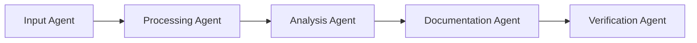

# Agentic Workflow Documentation Framework

## Overview
The Agentic Workflow Documentation Framework serves as a central Source of Truth (SoT) for multi-agent workflows, enabling coordinated development through structured information exchange and standardized interfaces.

## Core Components

### 1. Document Catalog System
```sql
CREATE TABLE document_catalog (
    id SERIAL PRIMARY KEY,
    file_path TEXT NOT NULL,
    file_type VARCHAR(10),
    last_modified TIMESTAMP,
    content_hash TEXT,
    metadata JSONB,
    agent_access_history JSONB[]
);

CREATE TABLE document_dependencies (
    source_doc_id INTEGER REFERENCES document_catalog(id),
    target_doc_id INTEGER REFERENCES document_catalog(id),
    dependency_type VARCHAR(50),
    metadata JSONB
);
```

### 2. Function Library
```sql
CREATE TABLE function_library (
    id SERIAL PRIMARY KEY,
    name VARCHAR(255),
    language VARCHAR(50),
    source_code TEXT,
    input_schema JSONB,
    output_schema JSONB,
    dependencies JSONB,
    metadata JSONB
);

CREATE TABLE function_usage (
    function_id INTEGER REFERENCES function_library(id),
    agent_id VARCHAR(255),
    timestamp TIMESTAMP,
    input_params JSONB,
    output_result JSONB,
    execution_metrics JSONB
);
```

### 3. SQL Query Catalog
```sql
CREATE TABLE sql_catalog (
    id SERIAL PRIMARY KEY,
    query_name VARCHAR(255),
    query_text TEXT,
    description TEXT,
    input_params JSONB,
    output_schema JSONB,
    performance_metrics JSONB
);
```

## Agent Workflow Orchestration

### 1. Agent Interface Definition
```python
class AgentInterface:
    def __init__(self, agent_id: str, capabilities: List[str]):
        self.agent_id = agent_id
        self.capabilities = capabilities
        self.input_requirements = []
        self.output_specifications = []

    def register_workflow(self, workflow_id: str):
        """Register agent in a specific workflow."""
        pass

    def get_input(self) -> Dict:
        """Retrieve input from previous agent."""
        pass

    def provide_output(self, output: Dict):
        """Submit output for next agent."""
        pass
```

### 2. Workflow Pipeline Definition


### 3. Document State Tracking
```python
class DocumentState:
    def __init__(self, doc_id: str):
        self.doc_id = doc_id
        self.version = 0
        self.state = "draft"
        self.agent_history = []
        self.modifications = []

    def update_state(self, agent_id: str, modification: Dict):
        """Track document modifications by agents."""
        pass
```

## Agent Coordination Mechanisms

### 1. Input/Output Contract
```json
{
  "contract": {
    "input": {
      "type": "object",
      "required": ["document_id", "operation", "parameters"],
      "properties": {
        "document_id": {"type": "string"},
        "operation": {"type": "string"},
        "parameters": {"type": "object"}
      }
    },
    "output": {
      "type": "object",
      "required": ["status", "result", "metadata"],
      "properties": {
        "status": {"type": "string"},
        "result": {"type": "object"},
        "metadata": {"type": "object"}
      }
    }
  }
}
```

### 2. State Management
```python
class WorkflowState:
    def __init__(self, workflow_id: str):
        self.workflow_id = workflow_id
        self.current_stage = 0
        self.agent_states = {}
        self.document_states = {}
        self.transition_history = []

    def transition_to_next_stage(self):
        """Manage workflow stage transitions."""
        pass

    def validate_state(self):
        """Ensure workflow state consistency."""
        pass
```

## Benefits for Agentic Workflows

### 1. Coordination
- Standardized interfaces for agent communication
- Clear input/output contracts
- State tracking and validation
- Dependency management

### 2. Quality Assurance
- Automated validation of agent outputs
- Consistent documentation standards
- Traceable modifications
- Version control integration

### 3. Scalability
- Modular agent design
- Parallel workflow execution
- Resource optimization
- Dynamic agent allocation

## Implementation Example

### 1. Document Processing Workflow
```python
class DocumentProcessor:
    def process_document(self, doc_id: str):
        # Initialize workflow
        workflow = WorkflowState(f"doc_process_{doc_id}")
        
        # Define agent sequence
        agents = [
            ParseAgent(),
            AnalysisAgent(),
            DocumentationAgent(),
            ValidationAgent()
        ]
        
        # Execute workflow
        for agent in agents:
            input_data = workflow.get_current_state()
            output = agent.process(input_data)
            workflow.update_state(output)
            workflow.transition_to_next_stage()
```

### 2. Database Update Workflow
```python
class DatabaseUpdater:
    def update_schema(self, schema_changes: Dict):
        # Initialize workflow
        workflow = WorkflowState("schema_update")
        
        # Define agent sequence
        agents = [
            SchemaAnalysisAgent(),
            MigrationPlanAgent(),
            SQLGenerationAgent(),
            ValidationAgent(),
            ExecutionAgent()
        ]
        
        # Execute workflow
        for agent in agents:
            input_data = workflow.get_current_state()
            output = agent.process(input_data)
            workflow.validate_output(output)
            workflow.transition_to_next_stage()
```

## Source of Truth Benefits

### 1. Centralization
- Single source for all project artifacts
- Consistent versioning
- Unified access control
- Automated synchronization

### 2. Traceability
- Complete modification history
- Agent interaction logging
- Decision tracking
- Impact analysis

### 3. Integration
- CI/CD pipeline integration
- Automated testing
- Documentation generation
- Metrics collection

## Future Enhancements

### 1. Machine Learning Integration
- Agent performance optimization
- Workflow pattern recognition
- Automated error correction
- Resource allocation optimization

### 2. Advanced Orchestration
- Dynamic workflow generation
- Parallel execution optimization
- Real-time monitoring
- Adaptive resource allocation

### 3. Enhanced Analytics
- Performance metrics
- Quality metrics
- Usage patterns
- Optimization opportunities