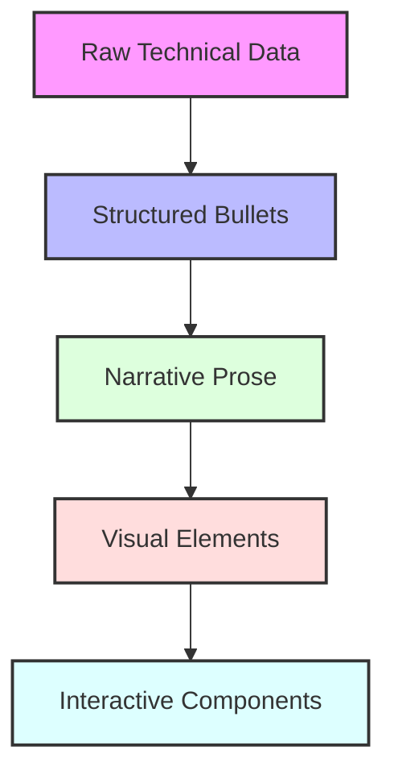
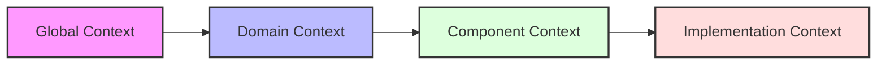
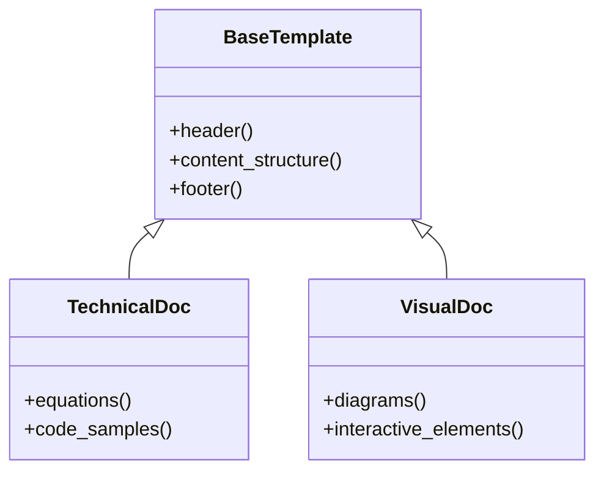

# Documentation Evolution Framework

## Overview
This framework provides a structured approach to evolving technical documentation through multiple passes, building layers of understanding while maintaining coherence and technical accuracy.

## Core Components

### 1. Documentation Layers


### 2. Layer Implementation

#### Layer 1: Technical Extraction
```yaml
technical_components:
  physics:
    - Forces
    - Integration
    - Collisions
  geometry:
    - Wheel Layout
    - Trajectories
    - Sectors
  analysis:
    - Probability
    - Distribution
    - Outcomes
```

#### Layer 2: Structured Knowledge
```yaml
knowledge_structure:
  components:
    - name: Component
    - elements: Count
    - complexity: Level
  organization:
    - hierarchical
    - relational
    - sequential
  validation:
    - completeness
    - accuracy
    - consistency
```

#### Layer 3: Narrative Integration
Example transformation:

**Before:**
```markdown
* Force calculations
  * Gravity
  * Normal force
  * Friction
* Integration method
  * Velocity Verlet
  * Error bounds
```

**After:**
```markdown
The physics engine implements a comprehensive force model that accounts for 
gravitational effects, normal forces, and friction. These forces are 
integrated using the Velocity Verlet method, chosen for its superior 
energy conservation properties and bounded error characteristics.
```

#### Layer 4: Visual Enhancement
```yaml
visualization_elements:
  diagrams:
    - flow_charts
    - architecture_diagrams
    - sequence_diagrams
  graphics:
    - infographics
    - illustrations
    - screenshots
  interactive:
    - code_samples
    - live_demos
    - animations
```

## Development Process

### 1. Tool Selection Strategy
```yaml
documentation_tools:
  discovery:
    tool: "Semantic Search"
    purpose: "Broad context gathering"
  analysis:
    tool: "Grep Search"
    purpose: "Specific implementation details"
  integration:
    tool: "File Reading"
    purpose: "Deep understanding"
  visualization:
    tool: "D3.js/R"
    purpose: "Interactive representation"
  validation:
    tool: "Linting"
    purpose: "Quality assurance"
```

### 2. Context Management


### 3. Template Customization


## Implementation Guidelines

### 1. Progressive Enhancement
- Start with core technical content
- Add structure incrementally
- Enhance with visuals
- Implement interactivity

### 2. Tool Selection
- Use semantic search for broad context
- Apply grep for specific details
- Implement file reading for deep understanding
- Integrate visualization tools for clarity

### 3. Quality Assurance
- Validate technical accuracy
- Ensure narrative flow
- Test interactive elements
- Verify cross-references

## Best Practices

### 1. Content Development
- Begin with clear technical foundations
- Structure information hierarchically
- Develop narrative flow
- Add visual enhancements
- Implement interactive elements

### 2. Documentation Evolution
- Maintain version control
- Track changes systematically
- Update cross-references
- Validate modifications
- Review regularly

### 3. Quality Standards
- Technical accuracy
- Clear structure
- Engaging narrative
- Visual clarity
- Interactive functionality

## Framework Benefits

### 1. Improved Understanding
- Progressive complexity
- Layered information
- Multiple learning styles
- Interactive engagement
- Comprehensive coverage

### 2. Maintainability
- Structured updates
- Version control
- Change tracking
- Quality assurance
- Systematic evolution

### 3. User Experience
- Clear navigation
- Engaging content
- Interactive learning
- Visual aids
- Comprehensive resources

## Future Enhancements

### 1. Automation
- Automated validation
- Template generation
- Cross-reference checking
- Version management
- Quality metrics

### 2. Integration
- CI/CD pipeline integration
- Automated testing
- Documentation generation
- Analytics integration
- Feedback collection

### 3. Analytics
- Usage patterns
- User engagement
- Content effectiveness
- Technical accuracy
- Enhancement opportunities