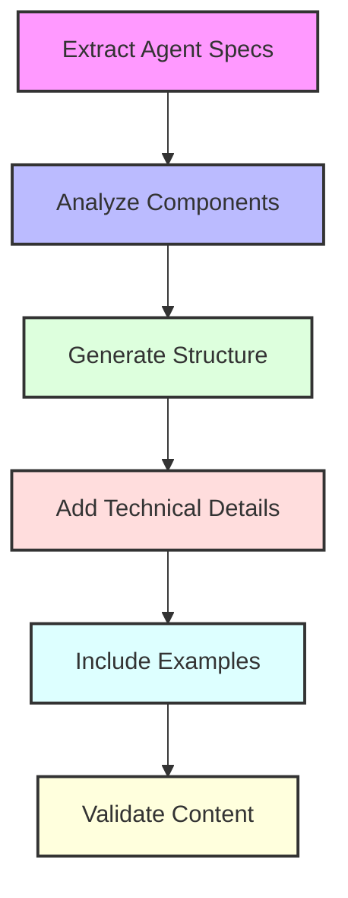
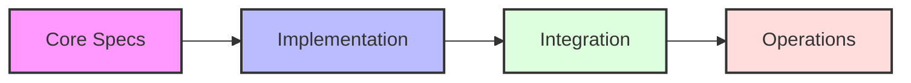
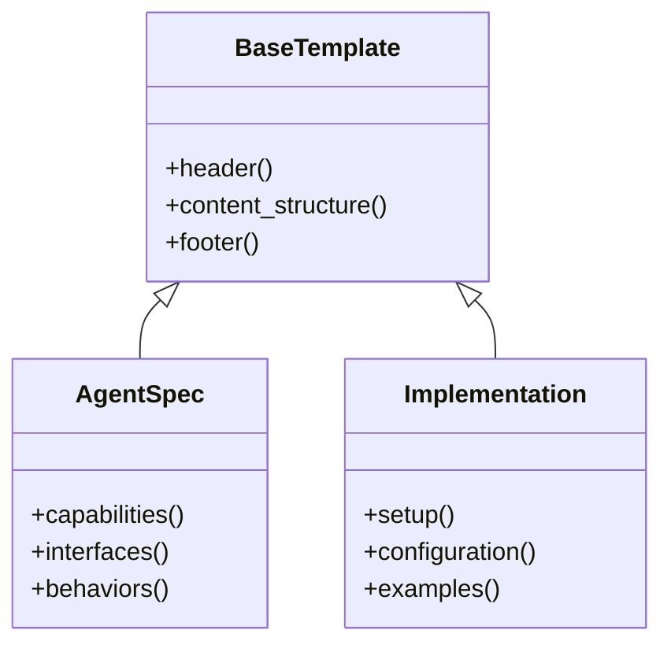

# Agent Documentation Generation Framework

## Overview
This framework provides a structured approach to generating comprehensive documentation for autonomous development agents, ensuring consistency, completeness, and maintainability across agent specifications.

## Core Components

### 1. Documentation Structure
```yaml
documentation_components:
  system_overview:
    - purpose
    - architecture
    - core_capabilities
  agent_specification:
    - interface_definitions
    - behavior_patterns
    - decision_logic
  technical_details:
    - implementation
    - dependencies
    - configuration
  operational_guides:
    - setup
    - maintenance
    - troubleshooting
```

### 2. Agent Interface Documentation
```typescript
interface AgentDocumentation {
  metadata: {
    agent_id: string;
    version: string;
    category: string;
    capabilities: string[];
  };
  
  interface: {
    inputs: InputSchema[];
    outputs: OutputSchema[];
    events: EventDefinition[];
  };
  
  behavior: {
    decision_logic: string;
    state_management: string;
    error_handling: string;
  };
}

type InputSchema = {
  name: string;
  type: string;
  validation: ValidationRule[];
  description: string;
};

type OutputSchema = {
  name: string;
  type: string;
  format: string;
  example: string;
};

type EventDefinition = {
  name: string;
  trigger: string;
  handlers: string[];
};
```

### 3. Documentation Generation Pipeline


## Development Process

### 1. Documentation Strategy
```yaml
documentation_strategy:
  analysis:
    tool: "Semantic Search"
    purpose: "Extract agent specifications"
    scope: ["source_code", "config_files", "tests"]
  
  generation:
    tool: "Template Engine"
    purpose: "Create consistent documentation"
    templates: ["overview", "technical", "operational"]
  
  validation:
    tool: "Doc Linter"
    purpose: "Ensure quality and completeness"
    checks: ["structure", "links", "examples"]
```

### 2. Content Organization


### 3. Template System


## Implementation Guidelines

### 1. Documentation Structure
- Clear hierarchy of information
- Consistent formatting
- Comprehensive coverage
- Cross-referencing

### 2. Content Requirements
- Technical accuracy
- Code examples
- Configuration details
- Troubleshooting guides

### 3. Quality Standards
- Completeness
- Consistency
- Clarity
- Maintainability

## Best Practices

### 1. Documentation Development
- Start with agent specifications
- Include implementation details
- Add configuration examples
- Provide troubleshooting guides

### 2. Content Management
- Version control
- Regular updates
- Cross-references
- Change tracking

### 3. Quality Assurance
- Technical review
- Content validation
- Example testing
- Link verification

## Framework Benefits

### 1. Consistency
- Standardized format
- Uniform structure
- Consistent terminology
- Clear organization

### 2. Maintainability
- Easy updates
- Version tracking
- Change management
- Documentation testing

### 3. Usability
- Clear navigation
- Practical examples
- Troubleshooting guides
- Quick reference

## Future Enhancements

### 1. Automation
- Template generation
- Content validation
- Example testing
- Link checking

### 2. Integration
- CI/CD pipeline
- Documentation testing
- Automated updates
- Version control

### 3. Analytics
- Usage tracking
- Content effectiveness
- User feedback
- Improvement metrics 