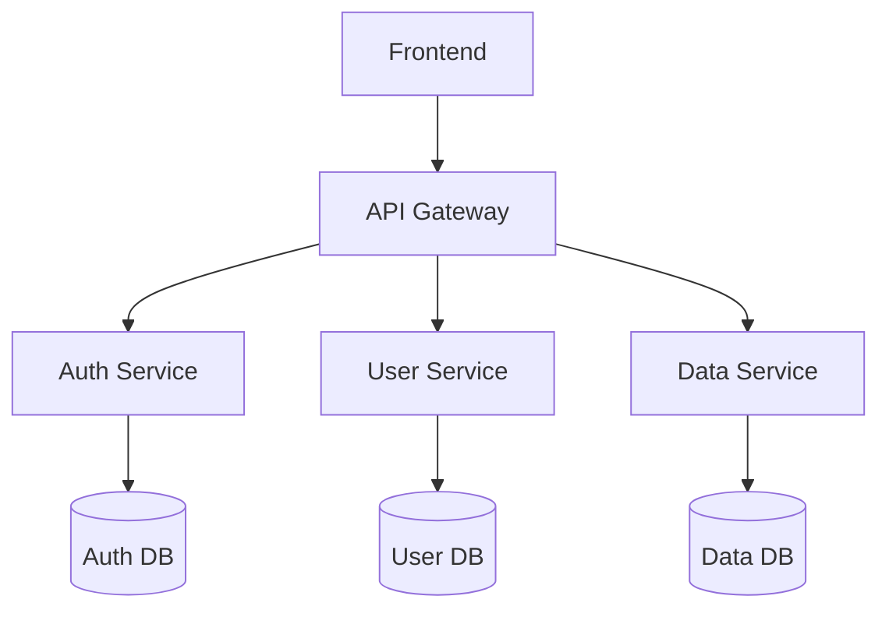
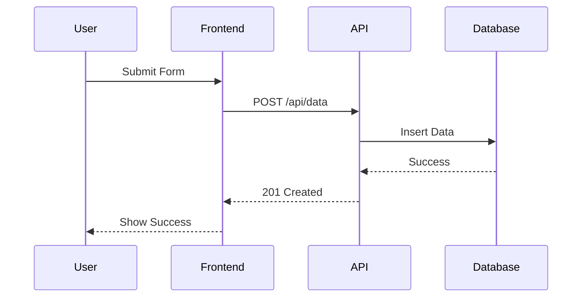
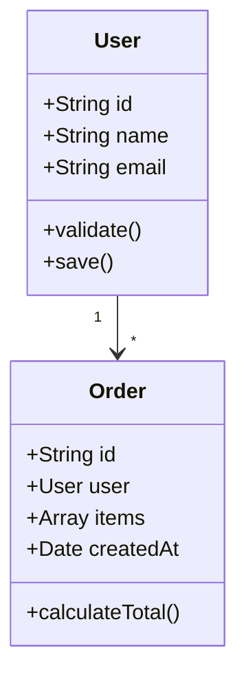
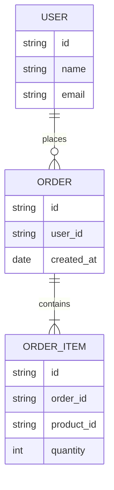
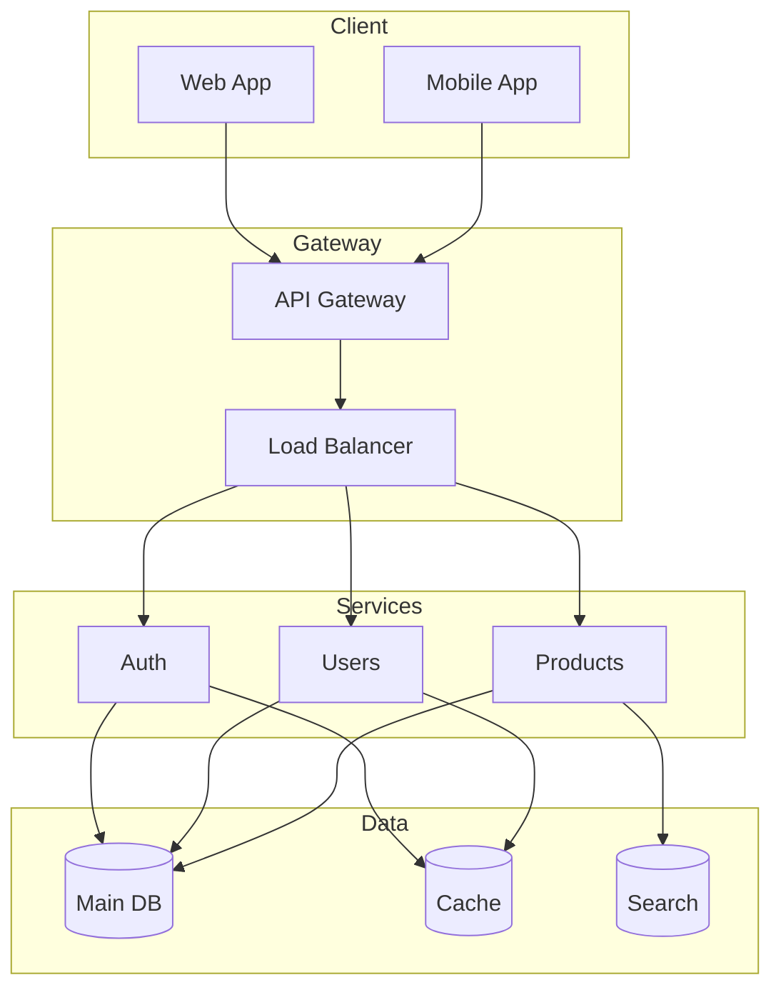
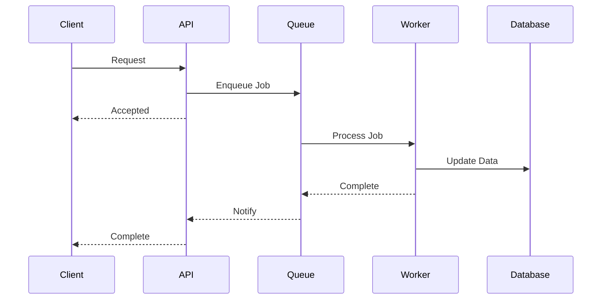
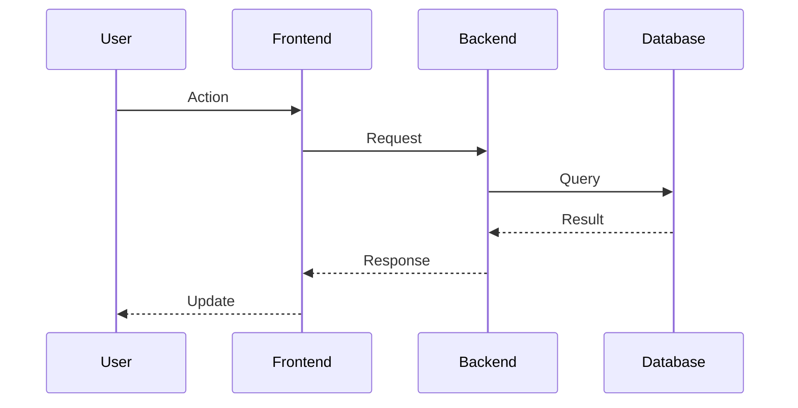

# Technical Diagram Creation Guide

## Core Principles
1. Clarity - Ensure diagrams are easy to understand
2. Consistency - Maintain uniform style and notation
3. Purpose - Focus on conveying specific information
4. Accessibility - Make diagrams readable for all audiences

## Diagram Types

### 1. Architecture Diagrams


### 2. Sequence Diagrams


### 3. Class Diagrams


### 4. Entity Relationship Diagrams


## Tools and Setup

### 1. Mermaid.js Configuration
```javascript
// mermaid.config.js
export default {
  theme: 'default',
  themeVariables: {
    primaryColor: '#326CE5',
    primaryTextColor: '#fff',
    primaryBorderColor: '#285AB4',
    lineColor: '#666',
    secondaryColor: '#7F7F7F',
    tertiaryColor: '#fff',
  },
  flowchart: {
    curve: 'basis',
    padding: 15,
  },
  sequence: {
    mirrorActors: false,
    bottomMarginAdj: 10,
    messageAlign: 'center',
  },
}
```

### 2. PlantUML Setup
```plantuml
@startuml
!theme plain
skinparam backgroundColor transparent
skinparam useBetaStyle true
skinparam handwritten false
skinparam defaultFontName "Arial"
skinparam defaultFontSize 12
skinparam roundCorner 8
skinparam dpi 300
skinparam arrowColor #666666
skinparam arrowThickness 1.5
@enduml
```

## Diagram Patterns

### 1. System Architecture


### 2. Component Interaction


## Documentation Integration

### 1. Markdown Integration
```markdown
# System Overview

## Architecture


The system consists of the following components:

1. Frontend Applications
   - Web Application
   - Mobile Application

2. Backend Services
   - API Gateway
   - Authentication Service
   - User Service
   - Data Service

## Sequence Flow

```

### 2. API Documentation
```yaml
openapi: 3.0.0
info:
  title: API Documentation
  version: 1.0.0
paths:
  /users:
    get:
      summary: Get users
      description: |
        ```mermaid
        sequenceDiagram
            Client->>API: GET /users
            API->>DB: Query users
            DB-->>API: User data
            API-->>Client: User list
        ```
      responses:
        '200':
          description: Success
```

## Best Practices

### 1. Design
- Use consistent shapes and colors
- Maintain clear hierarchy
- Include legend when necessary
- Keep diagrams focused and simple
- Use appropriate level of detail

### 2. Layout
- Organize elements logically
- Use whitespace effectively
- Align elements properly
- Follow left-to-right/top-to-bottom flow
- Group related elements

### 3. Content
- Use clear labels
- Include necessary context
- Avoid technical jargon
- Provide descriptions
- Version control diagrams

### 4. Maintenance
- Keep diagrams up to date
- Document diagram sources
- Use automated generation
- Review periodically
- Track changes

## Tools and Resources

### 1. Recommended Tools
- Mermaid.js for code-based diagrams
- PlantUML for UML diagrams
- Draw.io for complex diagrams
- Lucidchart for team collaboration
- Figma for design-focused diagrams

### 2. Integration Tools
- VS Code extensions
- Documentation generators
- CI/CD pipeline tools
- Version control systems
- Collaboration platforms

## Resources
1. [Mermaid.js Documentation](https://mermaid-js.github.io/mermaid/)
2. [PlantUML Guide](https://plantuml.com/guide)
3. [C4 Model](https://c4model.com/)
4. [AWS Architecture Icons](https://aws.amazon.com/architecture/icons/)
5. [Google Cloud Icons](https://cloud.google.com/icons)