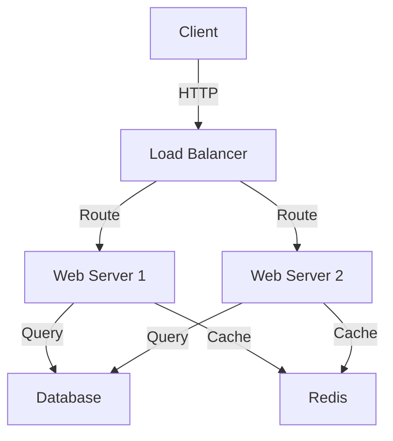
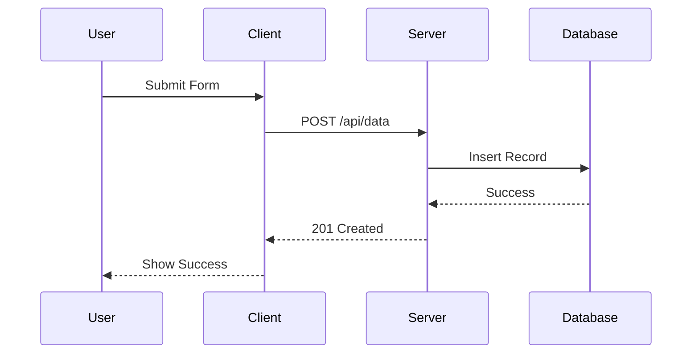
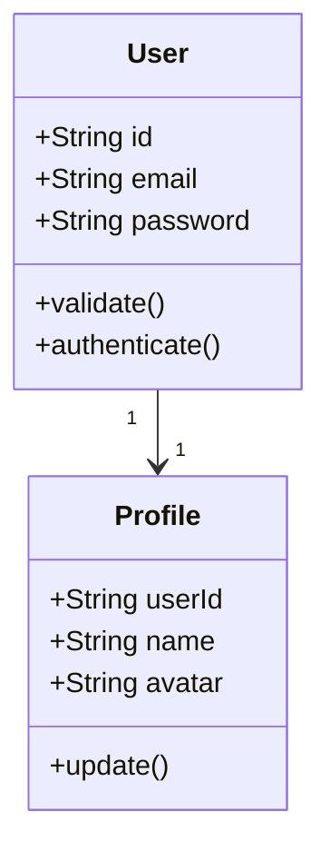
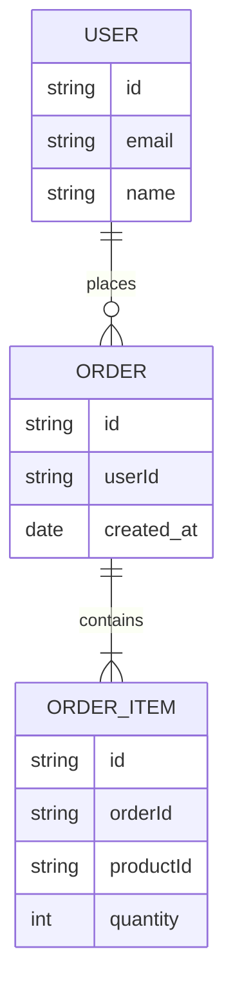
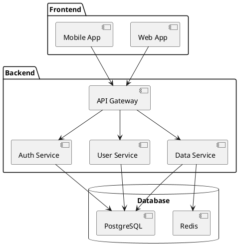
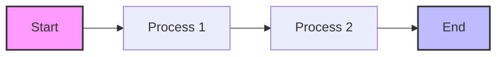
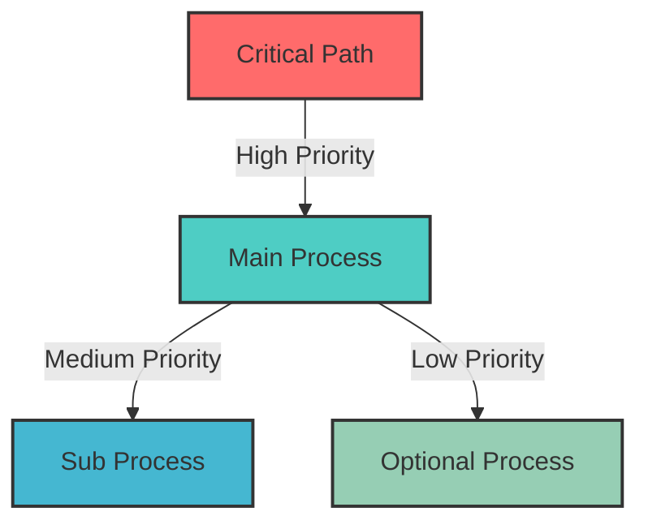
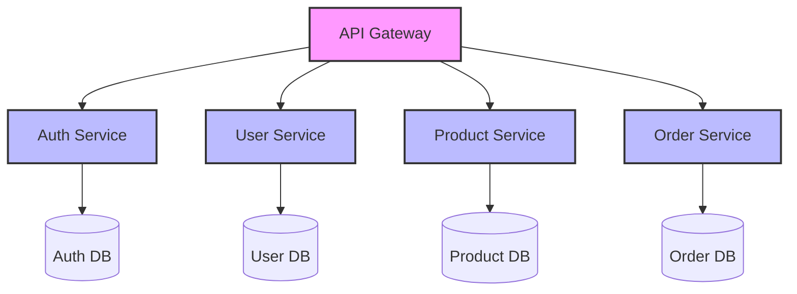
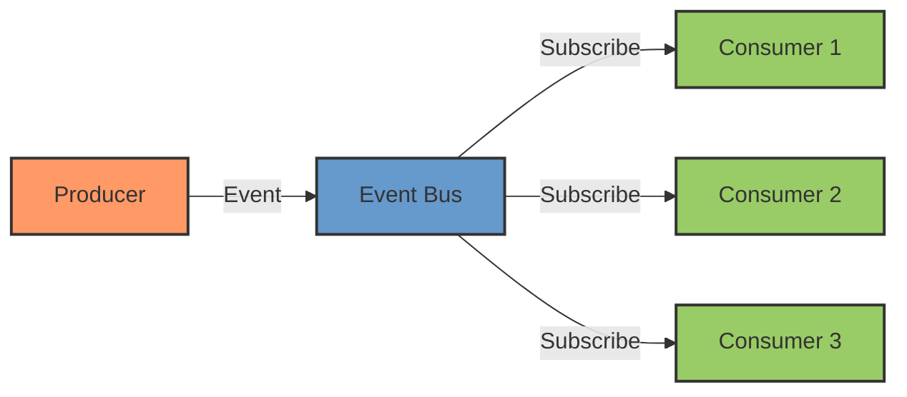
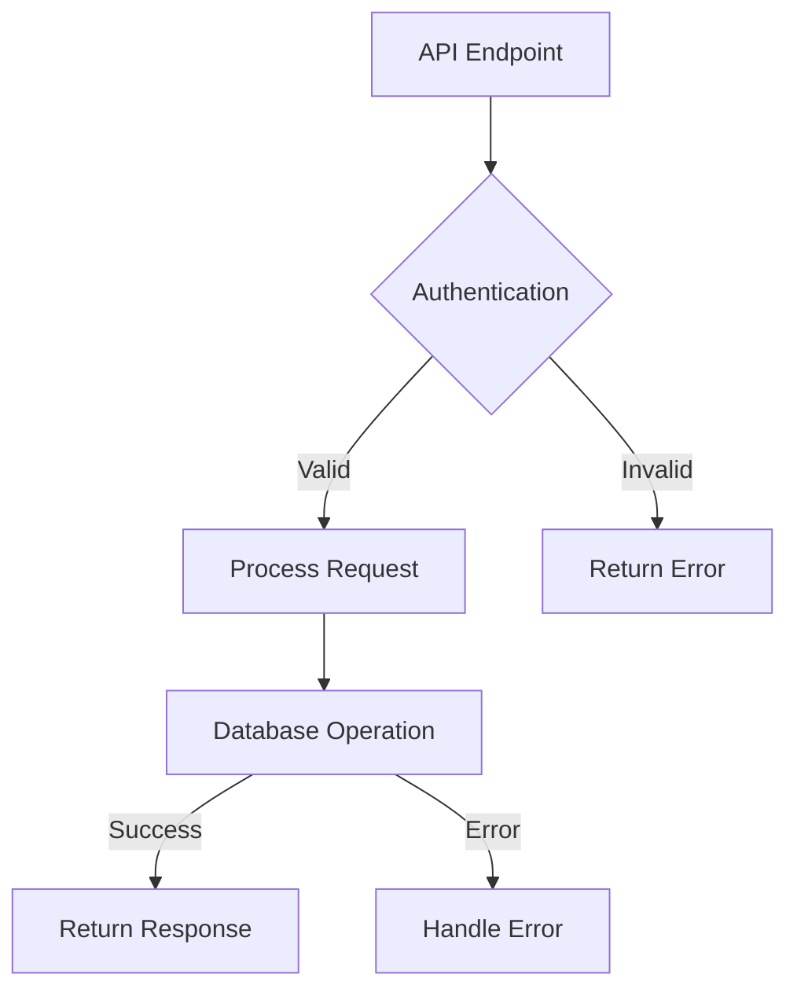

# Technical Diagram Guide

## Overview
This guide provides a structured approach to creating technical diagrams that effectively communicate system architecture, workflows, and technical concepts.

## Diagram Types

### 1. Architecture Diagrams


### 2. Sequence Diagrams


### 3. Class Diagrams


### 4. Entity Relationship Diagrams


## Tools and Formats

### 1. Mermaid.js
```javascript
// Example configuration
const config = {
  theme: 'default',
  themeVariables: {
    primaryColor: '#ff0000',
    primaryTextColor: '#fff',
    primaryBorderColor: '#ff0000',
    lineColor: '#f00',
    secondaryColor: '#006100',
    tertiaryColor: '#fff'
  }
}
```

### 2. PlantUML


### 3. Draw.io
```xml
<mxfile>
  <diagram id="example" name="Example">
    <mxGraphModel>
      <root>
        <mxCell id="0"/>
        <mxCell id="1" parent="0"/>
        <mxCell id="2" value="Component" style="rounded=1;whiteSpace=wrap;html=1;" vertex="1" parent="1">
          <mxGeometry x="120" y="120" width="120" height="60" as="geometry"/>
        </mxCell>
      </root>
    </mxGraphModel>
  </diagram>
</mxfile>
```

## Best Practices

### 1. Layout Guidelines


### 2. Color Usage


## Common Patterns

### 1. Microservices Architecture


### 2. Event-Driven Architecture


## Documentation Integration

### 1. README Format
```markdown
# System Architecture

## Overview
[Brief description of the system]

## Components
[Component diagram showing main parts]

## Workflows
[Sequence diagrams for key processes]

## Data Model
[Entity relationship diagram]

## Deployment
[Deployment architecture diagram]
```

### 2. API Documentation


## Best Practices

1. Diagram Organization
   - Use clear hierarchy
   - Group related components
   - Show important relationships
   - Maintain consistent style

2. Visual Design
   - Use appropriate colors
   - Keep consistent spacing
   - Add clear labels
   - Include legend when needed

3. Documentation
   - Link to source code
   - Explain key decisions
   - Document changes
   - Version control diagrams

4. Maintenance
   - Update regularly
   - Review for accuracy
   - Archive old versions
   - Track changes

Remember to:
1. Keep diagrams simple
2. Focus on clarity
3. Use consistent notation
4. Include necessary context
5. Update documentation 